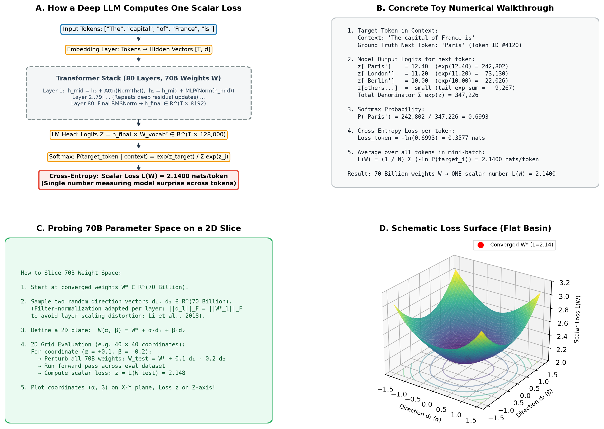

# Loss Landscape and Flat Minima

#ml-systems #training #interview-prep

**Scope**: Forward pass to scalar loss computation in deep multi-layer transformers, high-dimensional loss landscape slicing techniques (filter normalization, trajectory PCA), empirical evidence for wide basins in LLMs, and why wide basins tolerate reduced-precision arithmetic (BF16, FP8).

**Prerequisites**: [[ml-systems/training/cross-entropy-and-bpb]] for loss metrics and [[ml-systems/training/floating-point-formats]] for floating-point precision formats.

## TL;DR

A deep language model maps billions of parameters and input tokens to a single scalar cross-entropy loss value. High-dimensional loss landscapes are visualized by evaluating the scalar loss across a 2D plane spanned by two filter-normalized direction vectors ($W(\alpha, \beta) = W^* + \alpha d_1 + \beta d_2$). Modern LLMs with residual connections and normalization exhibit wide loss basins where the vast majority of Hessian eigenvalues cluster near zero alongside a small set of sharp outliers (Ghorbani et al., 2019). While flatness is parameterization-dependent (Dinh et al., 2017), filter-normalized basins explain why models tolerate BF16 mantissa rounding without loss degradation.

---

## Core Intuition

Understanding the loss landscape requires answering two questions:
1. **How does an 80-layer model produce one loss number?** No matter how many layers or parameters exist, the forward pass ends with cross-entropy over predicted next-token probabilities, averaging out to a single scalar number $\mathcal{L}(W)$ (such as `2.1400` nats/token).
2. **How do we visualize a 70-billion-dimensional space?** We cannot plot billions of axes. Instead, we pick two representative direction vectors through the parameter space, evaluate the model's scalar loss at points across that 2D plane, and plot the resulting 3D bowl.

```
       70-Billion Parameter Space                      2D Sliced Visualization
             (Unvisualizable)                               (3D Bowl Surface)
                   R^70B                                         Loss L(W)
         [w₁, w₂, w₃, ..., w_70B]                                   ^
                    │                                               │     \         /
                    ▼                                               │      \___*___/
   Sample 2 Direction Vectors d₁, d₂                                └────────────────> α
                    │                                              /
                    ▼                                             / β
   W(α, β) = W* + α·d₁ + β·d₂  ─── Compute L(W) on Grid ───► Topographic Map / Basin
```

---

## How It Works


*(Figure generated via `assets/generate_loss_landscape.py`)*

### Step 1: Forward Pass to Scalar Loss Mapping

In an $L$-layer transformer (such as LLaMA-70B with 80 layers and 70 billion parameters):

1. **Embedding**: Token IDs $[t_1, t_2, \dots, t_T]$ map to hidden vectors $h_0 \in \mathbb{R}^{T \times d}$ ($d = 8192$).
2. **Residual Blocks**: Each layer computes $h_l = h_{l-1} + \text{Attn}(\text{Norm}(h_{l-1})) + \text{MLP}(\text{Norm}(h_l^{\text{mid}}))$.
3. **Logits Projection**: The final hidden state $h_{\text{final}}$ multiplies the unembedding matrix $W_{\text{vocab}}^T \in \mathbb{R}^{d \times V}$ to produce logits $Z \in \mathbb{R}^{T \times 128,000}$.
4. **Softmax & Cross-Entropy**:
   For token position $i$ with ground truth target $t_{i+1}$:

   $$P(t_{i+1} \mid t_{\le i}) = \frac{\exp(z_{i, t_{i+1}})}{\sum_{j=1}^V \exp(z_{i, j})}$$

   $$\mathcal{L}_i = -\ln P(t_{i+1} \mid t_{\le i})$$

5. **Scalar Average**: The final loss $\mathcal{L}(W)$ is the average across all tokens in the batch:

   $$\mathcal{L}(W) = \frac{1}{N} \sum_{i=1}^N \mathcal{L}_i$$

The entire parameter vector $W \in \mathbb{R}^{70\text{B}}$ maps deterministically to a single real number $\mathcal{L}(W) \in \mathbb{R}$.

### Step 2: Probing High-Dimensional Spaces (Filter Normalization)

To explore the loss surface around converged weights $W^*$, researchers slice the parameter space using two direction vectors $d_1, d_2 \in \mathbb{R}^{P}$ (Li et al., 2018):

$$W(\alpha, \beta) = W^* + \alpha \cdot d_1 + \beta \cdot d_2$$

**The Filter Normalization Requirement**:
Neural network layers use normalization (LayerNorm, RMSNorm) which are scale-invariant: scaling a weight tensor $W_l$ by $\gamma$ and activations by $1/\gamma$ leaves the output unchanged. If direction vectors $d_1, d_2$ used isotropic Gaussian noise, layers with large weights would appear artificially flat, while layers with small weights would appear artificially sharp.

To prevent scale distortion, each convolutional filter or weight matrix slice $d_{l, j}$ is normalized to match the Frobenius norm of its corresponding weight tensor $W_{l, j}^*$:

$$d_{l, j} \leftarrow \frac{d_{l, j}}{\|d_{l, j}\|_F} \cdot \|W_{l, j}^*\|_F$$

Evaluating $\mathcal{L}(W(\alpha, \beta))$ on a coordinate grid produces the 3D surface shown in Panel D.

### Step 3: Empirical Evidence on Loss Landscape Curvature

| Method | What It Measures | Measured Findings in LLMs |
|---|---|---|
| **1. Hessian Spectrum** | Second-order loss curvature $\nabla^2 \mathcal{L}(W)$ | Bulk spectrum ($>99\%$) clusters near zero; a small set of sharp outliers dominates $\lambda_{\max}$ (Ghorbani et al., 2019) |
| **2. Noise Tolerance** | Loss change under Gaussian weight noise $W^* + \mathcal{N}(0, \sigma^2)$ | Wide valleys exhibit minimal loss degradation under small parameter perturbations (Keskar et al., 2017; He et al., 2019) |
| **3. 4-bit Quantization (PTQ)** | Snapping weights to 16 levels per group (AWQ/GPTQ) | Per-group scaling recovers dynamic range, keeping perplexity degradation to a few tenths |
| **4. Linear Mode Connectivity** | Loss along linear path $(1-\alpha)W_A + \alpha W_B$ between checkpoints | Checkpoints connect via continuous low-loss valleys |
| **5. Parameterization Caveat** | Invariance under reparameterization | Dinh et al. (2017) proved raw Hessian flatness is not reparameterization-invariant; filter normalization is required |

### Step 4: Why Wide Basins Enable Low-Precision Formats

The geometry of filter-normalized basins explains why deep learning models tolerate reduced precision (BF16, FP8):

1. **Mantissa Rounding Stays Inside the Basin**:
   BF16 has 7 mantissa bits (worst-case relative error $0.39\%$ under RNE). Because the loss basin is broad across the vast majority of directions, small spatial displacements along the loss surface cause negligible changes in loss.
2. **The Asymmetry Between Exponent and Mantissa**:
   Losing an exponent bit causes underflow (clamping to $0.0$) or overflow (exploding to $\text{NaN}$), acting as a discontinuous cliff. Losing a mantissa bit causes a bounded spatial displacement within the basin, degrading gracefully.

---

## Key Trade-offs & Decisions

### Landscape Curvature Properties

| Property | Bulk Directions ($>99\%$) | Outlier Directions ($<1\%$) |
|---|---|---|
| **Eigenvalue Magnitude** | Near zero ($\lambda \approx 0$) | Large isolated $\lambda_{\max}$ (Ghorbani et al., 2019) |
| **Curvature Type** | Wide, flat valley | Steep canyon walls |
| **Precision Impact** | Tolerates coarse mantissa (BF16, FP8) | Requires high precision or FP32 master weights |
| **Quantization Behavior** | Quantizes to 4-bit easily | Requires outlier retention (e.g. LLM.int8() / AWQ salient channels) |

### Optimization Dynamics & Landscape Sharpness

- **Mini-Batch Size & Flat Minima (Keskar et al. 2017)**: Small batches ($B \le 4096$) provide gradient noise that drives optimization into flat minimizers, whereas large batches risk trapping in sharp minima (Hochreiter & Schmidhuber 1997). Parameter norms are bounded by weight decay (van Laarhoven 2017).
- **Ultra-Large Batch Sizes ($B > 32,768$)**: Reduced gradient variance requires learning rate warmup and adaptive scaling to prevent trapping in sharp minima.

---

## Interview Talking Points

1. **How is a scalar loss computed in a 70B parameter LLM?**
   The forward pass propagates token representations through residual transformer layers to the unembedding head, computing softmax cross-entropy over target tokens. The individual token losses are averaged across the batch into a single scalar value measuring average surprise.

2. **How can you visualize a high-dimensional loss surface in 2D or 3D?**
   Using filter-normalized 2D slicing (Li et al., 2018). We sample two direction vectors $d_1, d_2$, normalize each layer slice to match the Frobenius norm of the layer's weights, evaluate the scalar loss over a grid $W(\alpha, \beta) = W^* + \alpha d_1 + \beta d_2$, and plot the resulting 3D surface.

3. **What does the Hessian eigenvalue spectrum look like in deep transformers?**
   The spectrum decomposes into a bulk of near-zero eigenvalues ($>99\%$) and a small set of isolated large outlier eigenvalues (Ghorbani et al., 2019). The bulk allows coarse mantissa quantization, while the outliers dictate the maximum stable learning rate.

4. **Why is raw Hessian flatness not a complete guarantee of generalization?**
   Dinh et al. (2017) showed that in networks with scale-invariant activations (like ReLU or RMSNorm), weights can be rescaled to make the Hessian arbitrarily sharp without changing the underlying mathematical function. Filter normalization fixes this by scaling direction slices relative to weight norms.

5. **Why do wide basins make BF16 and FP8 training possible?**
   Low mantissa precision introduces bounded rounding perturbations ($0.39\%$ for BF16). Across the bulk flat directions, small displacements along the loss surface produce negligible loss increases.

---

## See Also

- [[ml-systems/training/floating-point-formats]] — IEEE 754 precision formats (FP32, BF16, FP8) and why mantissa resolution is tolerated in flat basins
- [[ml-systems/training/cross-entropy-and-bpb]] — mathematical foundations of cross-entropy, entropy floors, and token perplexity
- [[ml-systems/training/scaling-laws]] — empirical scaling of loss against compute budget, parameters, and tokens
- [[ml-systems/foundations/norms-and-regularization]] — how LayerNorm and RMSNorm smooth loss surfaces and create scale invariance
- [[ml-systems/training/first-order-optimizers]] — AdamW decoupled weight decay and relative step size dynamics guiding convergence to flat basins
